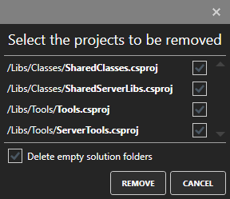

# ProjectRemover
#### Visual Studio 2017 - [Download](https://marketplace.visualstudio.com/items?itemName=Printcom.VisualStudioProjectRemover)
### Overview
ProjectRemover is a Visual Studio extension, which removes unused projects included in a visual studio solution. 
The extension extends the context menu of the solution with a new function. 

After ProjectRemover is started, all messages are written to the output window.

### Functionality
All projects which are located in the folder or a subfolder of the .sln file, will be classified as root projects. The extension will never remove these kind of projects. After collecting all root projects all references of these projects and their projects (recursive check) will be analysed. Finally all projects which aren't referenced in any way by a root project  will be removed. 

You can select the projects to be removed (default all projects are selected):

